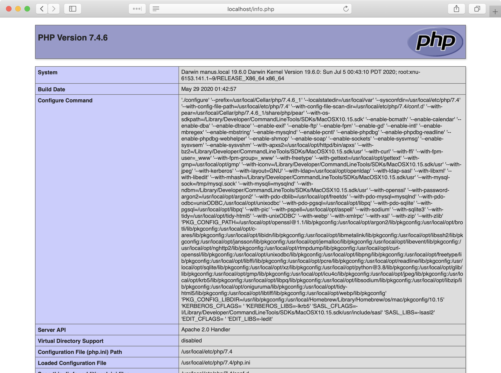

# Install Apache-PHP-MySQL on macOS

## A preamble

**macOS** usually comes with Apache and PHP pre-installed. It may be tempting to use them, but they support a limited set of features, and are not easily configurable. The best thing is to ignore/disable them, and use a modern package manager (Homebrew, alse known as just Brew, see below) to install our own version. Homebrew will also make it easier to upgrade them to new versions in the future.

## A security note

DO NOT USE THIS GUIDE TO SET UP A PUBLIC FACING SERVER.

The steps outlined here will install a web server, PHP and a database on your local machine, and set security measures "good enough" for a local development environment. By default your local machine is not accessible to the public as a server, but only locally.

**Note:** Your computer is still open to network requests coming from the Wi-Fi network you are using. This is good because you can use your phone to test a website that's running on your machine. But be aware of public networks, such as in cafés.

## Pre-requisites

Before we can start installing the real stuff, we need to prepare our system to make sure we have all the tools. The following commands may take several minutes to complete, that's normal! Open your terminal and run it one at a time.

1. Install **XCode Command Line Tools** (it's required by Homebrew):
   ```
   $ xcode-select --install
   ```
2. Install **Homebrew** ([Homebrew](https://brew.sh/) is the most popular and recommended macOS package manager, similar to **apt** for Ubuntu):
   ```
   $ /bin/bash -c "$(curl -fsSL https://raw.githubusercontent.com/Homebrew/install/master/install.sh)"
   ```
3. Verify your Homebrew installation (it will instruct you if you need to correct anything):
   ```
   $ brew doctor
   ```
4. Install a few required libraries:
   ```
   $ brew install openldap libiconv
   ```

Now we have to do one last check to make sure everything is _really_ well configured.

1. In the terminal type:
   ```
   $ echo $PATH
   ```
   It will show you a list of folders separated by `:`. Make sure that the folder `/usr/local/sbin` is included somewhere in there. Make sure it reads EXACTLY like that (also notice the 's' before 'bin'). If it is, great! Pass on to **1. Install Apache**. Otherwise, keep reading:
2. We have to make sure you are using the new **zsh** shell, recommended in **macOS**, as opposed to the older **bash**. In the terminal type:
   ```
   $ echo $ZSH_VERSION
   ```
   If you get a version number, jump to step **4**; if you see an empty line, see step **3**:
3. Update your mac to use **zsh**. In the terminal type:
   ```
   $ chsh -s /bin/zsh
   ```
   And then <u>open a new terminal window</u>.
4. Open the file `~/.zshrc` (If the file does not exist, create it). For example if you have VS Code:
   ```
   $ code ~/.zshrc
   ```
   _Note: to use the `code` command in the terminal you need to first have configured VS Code to [launch from the command line](https://code.visualstudio.com/docs/setup/mac#_launching-from-the-command-line)._
5. At the end of the files, add the lines (the first one is just a comment to remember why we put it there):
   ```
   # For Homebrew
   export PATH="/usr/local/sbin:$PATH"
   ```
6. Save and exit. Then in the terminal type:
   ```
   $ source ~/.zshrc
   ```
7. Check that `/usr/local/sbin` is now included:
   ```
   $ echo $PATH
   ```

🙌

## 1. Install Apache

### Disable the built-in Apache

1. Stop the process, just in case it is running for some reason:
   ```
   $ sudo apachectl stop
   ```
2. Type the following command so that it is not auto-started the next time you boot your Mac:
   ```
   $ sudo launchctl unload -w /System/Library/LaunchDaemons/org.apache.httpd.plist 2>/dev/null
   ```

### Install the new version with Brew

1. Type (yes, the package is called "httpd", even though the brand name is "Apache" - they are the same thing):
   ```
   $ brew install httpd
   ```
2. Configure your Mac to auto-start apache:
   ```
   $ sudo brew services start httpd
   ```

Ta-Daaaaa! In your browser, navigate to http://localhost:8080: you should see a white page with a simple header saying "**It works!**".

#### Tips: Dealing with Apache from the terminal

Apache is controlled by a command named `apachectl`. You will often need to start, stop or restart the server. These are some useful commands (notice the use of "sudo"):

```
$ sudo apachectl start
$ sudo apachectl stop
$ sudo apachectl -k restart
```

Other times you will need to read the error logs to troubleshoot problems:

```
$ tail -f /usr/local/var/log/httpd/error_log
```

### A basic Apache configuration

If everything is working so far, it is time to configure Apache to make it more convenient for us. Apache's configuration file is located at `/usr/local/etc/httpd/httpd.conf`.

Open this file in your editor of choice. For example, if you use VS Code:

```
$ code /usr/local/etc/httpd/httpd.conf
```

_Note: to use the `code` command in the terminal you need to first have configured VS Code to [launch from the command line](https://code.visualstudio.com/docs/setup/mac#_launching-from-the-command-line)._

#### General configuration

1. First, we want to set the default listening port to `80` (by default it is set to `8080`). Look for the line that says:
   ```
   Listen 8080
   ```
   and change it to:
   ```
   Listen 80
   ```
2. Next, we want to change the **document root** for Apache. That is the folder where Apache will look to serve files by default. Since this is your own local development machine we will change it to a folder in your home directory, for example `/Users/your_user/Sites` (substitute `your_user` with your real username, for example in my case the folder would be `/Users/manuele/Sites`). You may choose a different folder if you want, and you can always change it later. Look for the line that says:
   ```
   DocumentRoot "/usr/local/var/www"
   ```
   and change it to:
   ```
   DocumentRoot /Users/your_user/Sites
   ```
   Then look for the line that says:
   ```
   <Directory "/usr/local/var/www">
   ```
   and also change it to:
   ```
   <Directory /Users/your_user/Sites>
   ```
3. Now we will change an obscure directive, no need to know what it does exactly right now, but it's a good setting to have on your local machine. In that same `<Directory>` block you will find an `AllowOverride` setting, this should be changed as follows:
   ```
   # AllowOverride controls what directives may be placed in .htaccess files.
   # It can be "All", "None", or any combination of the keywords:
   #   AllowOverride FileInfo AuthConfig Limit
   #
   AllowOverride All
   ```
4. One more obscure thing: look for a line that contains `mod_rewrite.so` and uncomment it by removing the leading `#`:
   ```
   LoadModule rewrite_module lib/httpd/modules/mod_rewrite.so
   ```

#### User & Group

By default, apache runs as the user `_www` and group `_www`. This will cause permission problems in the future. In the same file look for:

```
User _www
Group _www
```

and change it to (replace `your_user` with your real username):

```
User your_user
Group staff
```

#### Servername

Finally, Apache likes to have a server name in the configuration. Look for:

```
#ServerName www.example.com:8080
```

and change it to:

```
ServerName localhost
```

All done with the configuration. Save the `httpd.conf` file and restart Apache so that the changes take effect. In the terminal:

```
$ sudo apachectl -k restart
```

#### Testing it all out

If you don't have it already, make a `Sites` folder in your home directory. Then add a simple `index.html` file.

```
$ mkdir ~/Sites
$ echo '<h1>It really, really works!</h1>' > ~/Sites/index.html
```

_If you see a "Permission denied" error in your browser, try to restart your computer. The error should go away._

In your browser visit `http://localhost` (note: this time we don't need to specify the `:8080` port), and check that your new message is displayed. If it's "really, really working", well done! You have a working server 🚀

## 2. Install PHP 7.4

```
$ brew install php@7.4
```

It will take a little while since it has to install a lot of dependencies, but, yeah... That's basically it!  
Make sure PHP is started on every reboot. Run:

```
$ brew services start php
```

And finally <u>open a new terminal window</u> (important!).

### Configure PHP

PHP's configuration file is called `php.ini` and it resides in the `/usr/local/etc/php/7.4` folder. Open it in your editor of choice. If you use VS Code:

```
$ code /usr/local/etc/php/7.4/php.ini
```

1. Make sure PHP is configured to the right timezone (see [here](https://www.php.net/manual/en/timezones.php) for a complete list of supported timezones). It should be the same time as your computer. Look for the `date.timezone` setting, and set it for example to:
   ```
   date.timezone = "Europe/Brussels"
   ```
2. (Optional, but it may come handy in the future) Change the memory setting to allow for larger programs. Look for the `memory_limit` setting, and set it for example to:
   ```
   memory_limit = 256M
   ```

All done for now! Save and close the file, and check that PHP is up and alive in your terminal. Run:

```
$ php -v
```

and verify that all looks good.

### PHP with Apache

We have a working server, and we successfully installed PHP. Now we need to tell Apache to use it. Open the `/usr/local/etc/httpd/httpd.conf` file again, and look for the "Load Module" section. At the bottom of the section add the following line:

```
LoadModule php7_module /usr/local/opt/php@7.4/lib/httpd/modules/libphp7.so
```

Then look for the block:

```
<IfModule dir_module>
    DirectoryIndex index.html
</IfModule>
```

And change it to:

```
<IfModule dir_module>
    DirectoryIndex index.php index.html
</IfModule>

<FilesMatch \.php$>
    SetHandler application/x-httpd-php
</FilesMatch>
```

Save and close the file, and restart the server:

```
$ sudo apachectl -k restart
```

#### Testing it all out

PHP comes with a useful function called `phpinfo()` which displays all sorts of information on our PHP installation. Create a file called `info.php` in your `Sites/` folder with this one liner:

```
$ echo '<?php phpinfo();' > ~/Sites/info.php
```

Now point your browser to `http://localhost/info.php` and you should see a "shiny" PHP information page:



If you see something similar, congratulations! 🍹

### Virtual Hosts

A very handy feature for local development is to have multiple virtual hosts. This means that you can set up different custom domains to serve different folders on the same server as if they are all separate websites.

For example, if you had a folder named `/Users/your_user/Sites/becode` with an `index.php` file inside, you could reach it by visiting `http://becode.localhost`.

In fact, let's do just that!

#### The project folder

Create the folder `/Users/your_user/Sites/becode` (always substitute `your_user` with your real username), and then create an `index.php` file with:

```
$ echo '<h1>Even the vhost works!</h1>' > ~/Sites/becode/index.php
```

_Wait, are we writing HTML inside a PHP file? Will it work?? Well, yes it will. Just trust the process for now._

#### Apache

1. Apache comes preconfigured to support vhosts, but we need to enable it. Open the `/usr/local/etc/httpd/httpd.conf` file and **uncomment** the line:
   ```
   LoadModule vhost_alias_module lib/httpd/modules/mod_vhost_alias.so
   ```
   and the line:
   ```
   Include /usr/local/etc/httpd/extra/httpd-vhosts.conf
   ```
2. Now open this newly referenced file in your editor, for example with VS Code:

   ```
   $ code /usr/local/etc/httpd/extra/httpd-vhosts.conf
   ```

   This file has two example visrtual hosts already: go ahead and delete them. One important thing to remember is that these rules are matched in order. When you set up virtual hosts, you will lose your older document root, so you will need to add back support for that first as a virtual host. Make sure the following is in the file (remember to change `your_user`):

   ```
   <VirtualHost *:80>
      DocumentRoot "/Users/your_user/Sites"
      ServerName localhost
   </VirtualHost>

   <VirtualHost *:80>
      DocumentRoot "/Users/your_user/Sites/becode"
      ServerName becode.localhost
   </VirtualHost>
   ```

Don't forget to restart Apache every time you edit some configuration:

```
$ sudo apachectl -k restart
```

#### Dnsmasq

Traditionally, adding a new vhost to your machine would involve editing two files: `httpd-vhosts.conf` to establish a connection between a domain and a folder; and `/etc/hosts` to tell your machine that when it sees (or, when a browser sees) `becode.localhost` it should look into itself, as opposed to trying to find it on the internet.

Instead of editing the `/etc/hosts` file manually every single time, we can use a program called [Dnsmasq](http://www.thekelleys.org.uk/dnsmasq/doc.html) to basically say "every time you see a domain ending with `*.localhost` send the request directly to the localhost (`127.0.0.1`)", which will in turn look inside `httpd-vhosts.conf` for a match.

If all this sounds gibberish just know this: _from now on to add a vhost all you have to do is add an entry to `httpd-vhosts.conf`_.

But first, let's install and configure Dnsmasq.

1. Install it with Brew:
   ```
   $ brew install dnsmasq
   ```
2. Check that it is correctly installed by running:
   ```
   $ dnsmasq
   ```
   _You will probably get a "Permission denied" error. That's ok. We haven't configured it yet, but at least we know the program is installed._
3. Setup the `*.localhost` wildcard hosts:
   ```
   $ echo 'address=/.localhost/127.0.0.1' > /usr/local/etc/dnsmasq.conf
   ```
4. Start it and ensure it auto-starts in the future:
   ```
   $ sudo brew services start dnsmasq
   ```
5. Finally, add it to the resolvers:
   ```
   $ sudo mkdir -v /etc/resolver
   $ sudo bash -c 'echo "nameserver 127.0.0.1" > /etc/resolver/localhost'
   ```

To test it out, you can `ping` in your terminal a random `.localhost` domain. You should get something like this:

```
$ ping random.localhost
PING random.localhost (127.0.0.1): 56 data bytes
64 bytes from 127.0.0.1: icmp_seq=0 ttl=64 time=0.044 ms
64 bytes from 127.0.0.1: icmp_seq=1 ttl=64 time=0.118 ms
64 bytes from 127.0.0.1: icmp_seq=2 ttl=64 time=0.045 ms
```

_Note: the `ping` command goes on forever. Press <kbd>ctrl</kbd>+<kbd>C</kbd> to stop it._

And finally, to see if we have really wired everything correctly, in your browser visit `http://becode.localhost`. You should see your previously created page 💪

## 3. Install MySQL

Or should we say, **MariaDB**. [MariaDB](https://mariadb.org/) is an open source drop-in replacement for MySQL made by the original developers of MySQL, and is easily installed and updated with Brew.

Install MariaDB and make sure it auto-starts:

```
$ brew install mariadb
$ brew services start mariadb
```

Next, change the MySQL server password and secure the installation:

```
$ sudo mysql_secure_installation
```

_Note how even though the package we installed is called **MariaDB**, all terminology is still **mysql**._

This utility prompts you to define the MySQL root password and other security-related options, including removing remote access to the root user and setting the root password.

### Create a Mysql user

Before we move on, let's create a MySQL user that you can use in future exercises (it's always best not to use the **root** user). To make it easier I recommend keeping the username/password as becode/becode, so everybody in the class has the same access controls.

First, log in MySQL as **root**. In the terminal:

`$ mysql -u root -p`

Then at the prompt create the user with a password (note the ending `;`):

`CREATE USER 'becode'@'localhost' IDENTIFIED BY 'becode';`

And finally, grant this user access to all databases:

`GRANT ALL PRIVILEGES ON *.* TO 'becode'@'localhost';`

**Note:** On a production machine, you would never want to do grant access to all databases. It is considered best practice to have 1 user per database, this way if the password of one user is compromised the hacker cannot steal the data in the other databases.

To exit the MariaDB prompt type:

`exit;`

### (Optional) Install a GUI for MySQL

At times you will want to manage your database graphically, instead of from the command line. You have two options: PhpMyAdmin, or native apps.

[**PhpMyAdmin**](https://www.phpmyadmin.net/) is a free software written in PHP intended to handle the administration of MySQL/MariaDB over the Web. It's not so intuitive to install, the interface looks dated, but it is very powerful and it will often be a pre-installed tool on remote servers to manage their databases.

Native (macOS) apps are easy to install, and many have a powerful enough free version. I suggest you try different apps out and see which one feels better: [**TablePlus**](https://www.tableplus.io/) has an OK-working free version (limited to two tabs); [**Valentina Studio**](https://valentina-db.com) has a powerful free version; [**MySQL Workbench**](https://www.mysql.com/products/workbench/) is a free product by MySQL themselves which _probably_ works with MariaDB as well. You can find more (mostly paid) apps here: https://mariadb.com/kb/en/graphical-and-enhanced-clients/.

## 4. Install Xdebug

PHP comes with a powerful debugger extension: **Xdebug**.

You can compare it's working with the debugger for JS, and you will use this extensively when you work in PHP.

### Installation

Homebrew does not provide a keg for Xdebug anymore, so you must install it via [PECL](https://pecl.php.net/):

```
$ pecl install xdebug
```

### Configuration

The installation will have created a simple entry in the `php.ini` file, but you really need to configure Xdebug for it to be useful. Open the file, for example with VS Code:

```
$ code /usr/local/etc/php/7.4/php.ini
```

and remove (yes, **remove**), the following line:

```
zend_extension="xdebug.so"
```

Save and close.  
Now open (or create if it doesn't already exist) the file `/usr/local/etc/php/7.4/conf.d/ext-xdebug.ini`:

```
$ code /usr/local/etc/php/7.4/conf.d/ext-xdebug.ini
```

and add:

```
[xdebug]
zend_extension="xdebug.so"
xdebug.remote_enable=1
xdebug.remote_autostart=1
xdebug.remote_host=localhost
xdebug.remote_handler=dbgp
xdebug.remote_port=9000
```

Restart Apache with the usual `sudo apachectl -k restart` command, and check the `http://localhost/info.php` to ensure that Xdebug information is displayed.

### (Optional) Easy enable/disable of Xdebug

Xdebug can slow down PHP noticeably, so you may want to disable it at times.

1. Install [w00fz](https://github.com/w00fz/xdebug-osx)'s tool:
   ```
   $ curl -L https://raw.githubusercontent.com/w00fz/xdebug-osx/master/xdebug-toggle > /usr/local/bin/xdebug
   $ chmod +x /usr/local/bin/xdebug
   ```
2. Get the current state with:
   ```
   $ xdebug
   ```
3. And turn it on/off with:
   ```
   $ xdebug on
   $ xdebug off
   ```

### IDE

Configure your IDE to integrate with Xdebug.

#### PhpStorm

See the instructions in [readme.md](readme.md#installing-xdebug) (scroll towards the end, to the section titled **IDE: PHPSTORM**).

#### VS Code

Install the "PHP Debug" extension, by Felix Becker. That's all.

#### Other IDEs

If you use another IDE a quick google search will bring you to configuration instructions.

### Testing Xdebug

See the instructions in [readme.md](readme.md#installing-xdebug) (scroll towards the end, to the section titled **Testing Xdebug in PhpStorm/VS Code**).

## Mission accomplished!


