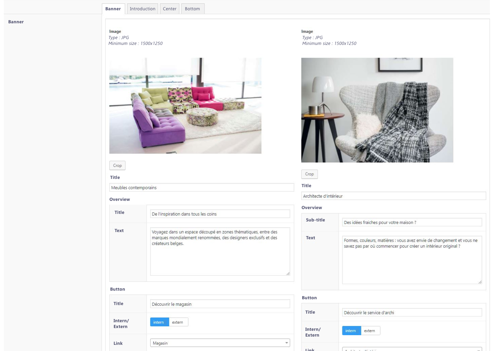
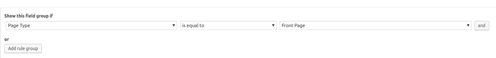
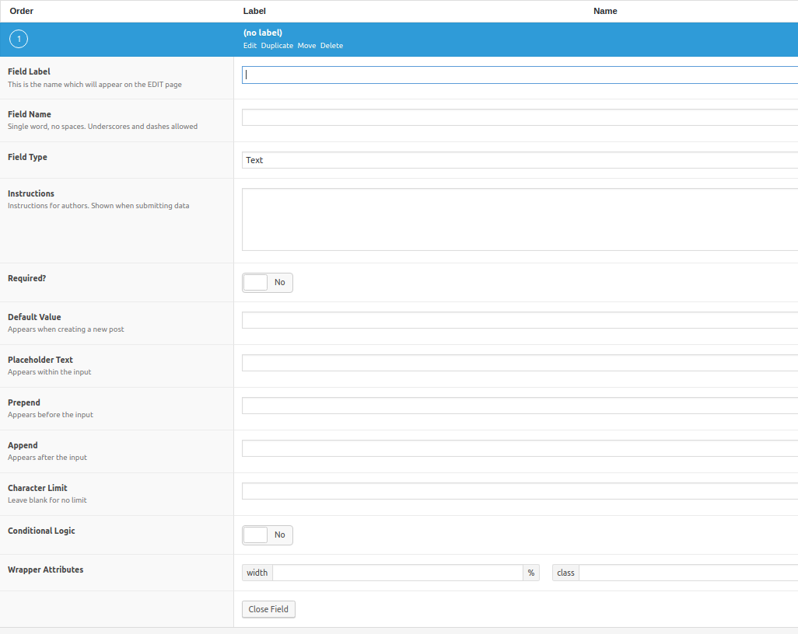
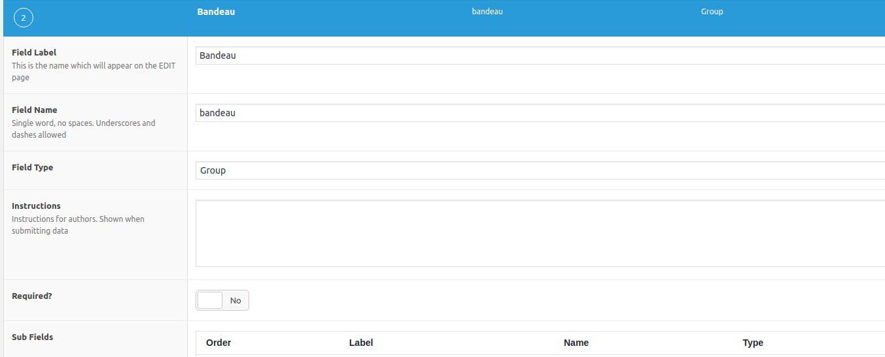
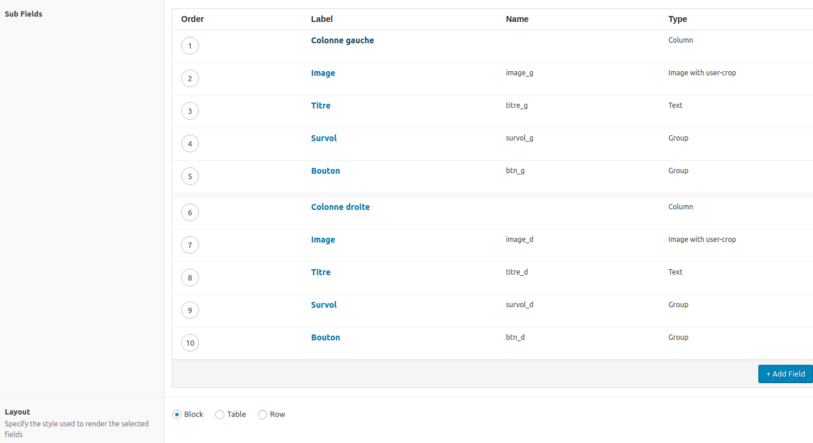
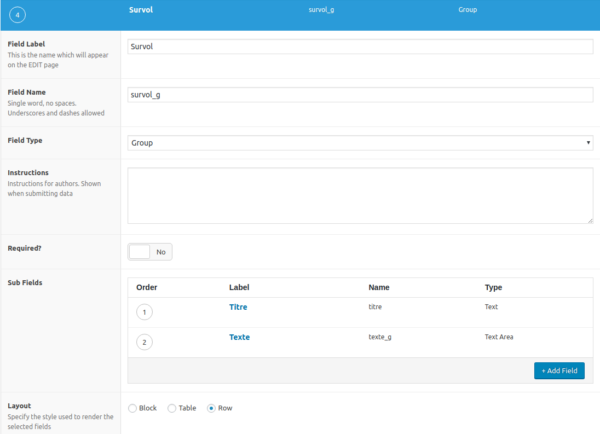
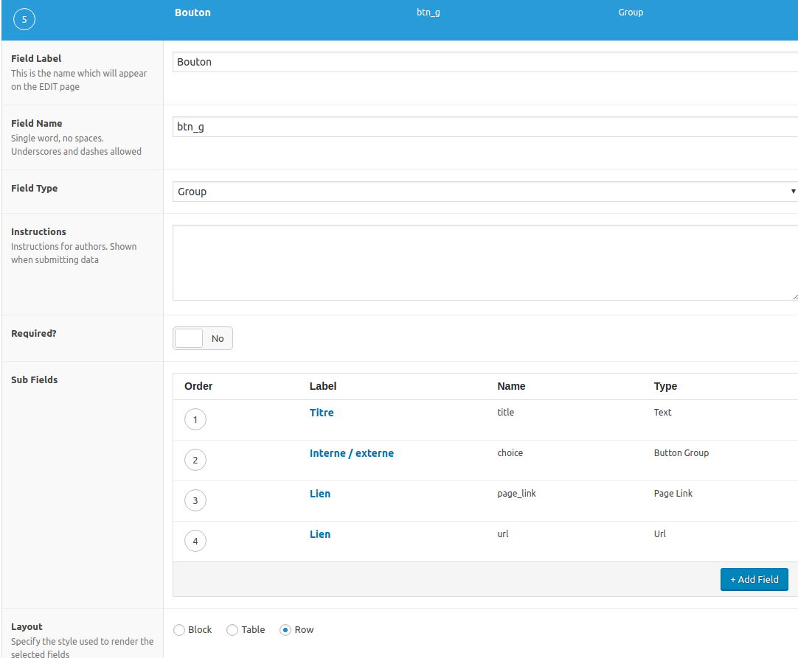

# ACF Tutorial : fields creation 

For learning how ACF runs, we will take as an example the homepage of the COMPOSITION website. 

You can see the design of the front page here : https://meubles-composition.be/

Here is how the fields could appear in the CMS part.

#### What do we see?

There are 4 tabs because the home page is split into 4 parts:
- the top banner
- Introduction
- Center
- Inferior

We will focus on the top banner, create all the required fields and make them appear like in the image above.

NB: As we use custom fields, we can deactivate the Gutenberg editor. I refer you to the chapter [`02. Functions.php`](../02.Functions.md) to be able to remove it.

## The fields group

First, go to the ACF plugin (or Custom Fields).  

Add a new type of fields. Name it *HOMEPAGE*

You see 3 main parts:
- The first is used to create your types of controls
- Location is used to determine on what type of content your fields will be active (pages, posts, categories ...)
- Settings allows you to manage options for the general display

### Settings

We will change 2 things in the settings.  

For `label placement`, choose `left aligned`.

In `Hide on screen`, check `Content editor` otherwise, a big wysiwyg will be displayed by default above our fields.   

### Location 

You must specify on which pages our controls will be active. Here there is only one, the home page.

We therefore select a particular type of page, like this.

NB: remember to create a specific page for the front page in your CMS.

## Fields creation

We are going to create the fields themselves.

Click on Add Field

Three important parts:
1. Field label: here put the name of the field. For example: "Banner"
2. Field name: this is the name of the slug that will be created in the DB. It is this name which will allow us to recover the value of the field on the front side.
3. Field type: the type of fields. You can see all the possibilities in the drop-down menu. To see what each field does and how to use them, go to the ACF website.

### Tab

For the first field, we will select `Tab`.

Placement `Top aligned`.

You have just created the first field !

Note that for the tabs, there is no slug, it is simply a layout to separate the sections.

### Group : banner

As you can see on the CMS print screen. You have 2 columns with similar content:
- image
- title
- overview
- button

This layout reflects the design.
To put the elements in a column, you must first create a group.
In Field Type, select `Group`, like this:

You notice that a `Group` field contains` Sub Fields`. This is where we will insert our columns.

### Columns

In the group we will insert 2 columns.
+ Add Field -> Column.
Since there are 2, put One Half in `Column Count`.

Under the column fields, we can insert our Image, Title, Hover and Button fields.

I'll show you the fields to enter for the left column.

### Image

Complete like this,

- Field label: Image
- Field name: image_g
- Field type: Image with user-crop
- Instructions: `Type: <b>JPG</b>   Minimum size: <b>1500x1250</b>` (We can give instructions to the client to tell him what type of file he can upload and their size)
- Crop type: Hard crop
- Target size: here you see the default Wordpress sizes. It would be necessary to create a format of 1500x1250. For this you need to add a hook in `functions.php` (but I'll let you find it). 
- Return value: Image Array. I always favor this type of value, because it is more complete. We will see later how to recover this value.

That's all.

### Title

- Field label: Titre
- Field name: titre_g
- Field type: Text

### Overview

- Field label: Survol 
- Field name: survol_g
- Field type: Group

### Button

- Field label: Bouton
- Field name: bouton
- Field type: Group

This button field is a group that contains several subfields.
There is a title, then a `Button Group`.

#### Button Group

This Button Group allows you to give the user the choice to create either an internal link or an external link.

Here's the procedure to follow: 
   - Field label: Intern / extern
   - Field name: choice
   - Field type: Button Group
   - Choices: 
     - pagelink : intern
     - url : externe
  - Link :
    - Field label: Link
    - Field name: page_link
    - Field type: Page Link
    - Filter by Post Type: Page
    - Allow Archives URLs: Yes
    - Conditional Logic: Yes
      - Show this field if : Intern / extern -> Value is equal to -> intern  
  - Link :
    - Field label: Link
    - Field name: url
    - Field type: Url
    - Conditional Logic: Yes
      - Show this field if : Interne / externe -> Value is equal to -> extern

## The other tabs

We have written all the fields. 
It now remains to insert the content.

I refer to [the first image](#top) where we see the completed fields for the `Banner` tab.

For the other tabs, therefore the other parts of the front-page, I'll let you manage.

For more informations, go on the [ACF website](https://www.advancedcustomfields.com/resources/repeater/) to learn how the others fields works. 

___

If you want to see how to retrieve the fields you just created, follow the path --> [Tutorial: take the fields in the templates](tutorial2.md)
