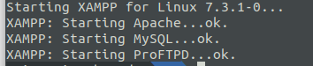

# WordPress installation and some basis

## 1. Set up your environment

> Before installation, check for the last apt-get or apt update on Ubuntu.

To use WordPress, it's recommended to install a HTTP server, Apache or Nginx.

You also need to have PHP and MySQL. 

Here, we will present 4 possibilities to set up your environment.

### 1.1. Docker 🐋

You can work with a container Docker containing Apache, PHP, MySQL and phpMyAdmin. 

To install, copy the folder [docker compose](../docker-compose/) somewhere in your computer. Then, build and up the environment and it is ready ! 

The official docker image of WordPress will be download in the `wordpress` folder. 

After the installation, you can directly [create the database](https://github.com/becodeorg/LIE-Jepsen-4.27/blob/master/03-the-mountain/04-wordpress/01-training/content/01.InstallationBases.md#3-the-database--wp-configphp).

To have more informations about the installation of Docker and the environment provided, read this guide : [Installation Docker Compose](../docker-compose/)

### 1.2. XAMPP

XAMPP is an abbreviation for cross-platform, Apache, MySQL, PHP and Perl, and it allows you to build WordPress site offline, on a local web server on your computer. 
 
[XAMPP](https://www.apachefriends.org/download.html). 

Once downloaded, go in your downloads directory and run the command to change the access to the package. For example :  


```sudo chmod 755 xampp-linux-x64-8.0.0-1-installer.run```

Then, run the installation : 

```sudo ./xampp-linux-x64-8.0.0-1-installer.run``` 
  
And it's done !  
  
XAMPP had created the directory ```/opt/lampp/htdocs``` 

It remains to give it write rights :


```sudo chmod -R 755 /opt/lampp/htdocs```

Now, you can start your server :

```sudo /opt/lampp/lampp start```



*If you got the error "Web server already running", check what is running on ports 80 and 443.*

To open your local server in your browser, go on http://localhost

*This is the minimum config. To configure and secure more, I'll let you know*

### 1.3. LAMP

If you want to install the stack (Apache, MySQL, PHP) one by one, choose [LAMP](https://www.digitalocean.com/community/tutorials/how-to-install-linux-apache-mysql-php-lamp-stack-on-ubuntu-20-04)

### 1.4. Local by Flywheel

A pre-made tool which contains everything you’ll need to set up and use local sites : https://localwp.com/


## 2. Install WordPress

1. Download WorpdPress on the official website : https://wordpress.org/download/ 

2. Unzip and move the directory `ẁordpress` in your repository. If you use Xampp, your repo should be in the htdocs directory.  

3. Rename the `wordpress` directory with the name of your futur website, for example : `firstWordPress`


## 3. The database & wp-config.php

1. Before to start WordPress, you must create a database. 

If you use Docker, go on [http://localhost:8001](http://localhost:8001)

If you use Xampp, go on [http://localhost/phpmyadmin/](http://localhost/phpmyadmin/)

Add a new database.

Example :  

- Database name : `firstWordPress` 
- Interclassent : `utf8_unicode_ci`

2. In your WordPress directory, open the file `wp-config.php` and change the informations for the connection with your DB. 

For example :

```php
// ** MySQL settings - You can get this info from your web host ** //
/** The name of the database for WordPress */
define('DB_NAME', 'firstWordPress');

/** MySQL database username */
define( 'DB_USER', 'root' );

/** MySQL database password */
define( 'DB_PASSWORD', 'root' );

/** MySQL hostname */
define( 'DB_HOST', 'localhost' );

👉 For docker
/** MySQL hostname */
define( 'DB_HOST', getenv_docker('WORDPRESS_DB_HOST', 'mysql') );

```

3. If is not done by default, rename the file `wp-config-sample.php` in `wp-config.php`

> 👉 To allow plugins to be installed on Linux, you may write the following line in your `wp-config.php` file : `define('FS_METHOD','direct');`


## 4. Terminate the installation

In your browser, go to `localhost` or `localhost/firstWordPress`(if you use Xampp).

Normally, the WordPress installation starts up and it ask you to provide your informations, especially regarding the database configuration :

- Database name 
- Database username (by default it's root)
- Password
- The database adress
- Database prefix : not necessary to change


## 5. WordPress connection

Write down your login details somewhere. We quickly forget...

-----

[02. The WordPress files and folders organisation](02.structurefichiers.md)
