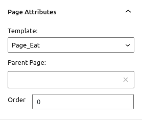

# The theme's template hierarchy

## Introduction

[Explanation in the Codex](https://codex.wordpress.org/Theme_Development)

There are already many existing themes. So why create your own theme? Here are the advantages of creating your own theme :

- It’s free, and if you make a killer death theme, you can even sell it. 
- It’s creating your own universe, with the look you want,
- from a technical point of view this helps the learning and deep understanding of WordPress

To create a theme, you must first add a folder with the name of your theme in the `wp-content/themes` directory.

In WordPress, a theme has a fairly simple structure, because it requires at least three files!

`index.php`, `functions.php` and `style.css`

To be able to retrieve its theme in the dashboard add a `style.css` and put the information of your theme.


Example :

```
/*
Theme Name: firstWordpress
Description: my first wordpress theme
Author: Monsieur Jamar
Author URI: https://github.com/NicolasJamar
Version: 1.0
*/
```

Except the `style.css`, other files are `php` templates.

## Templates hierarchy

Take a look at this document: https://wphierarchy.com/

This will be your guide for creating your `php` templates. It will help you understand the link between the back-end and front-end part of the CMS.

Here is the list of all basic templates with a WordPress site:
- index.php
- front-page.php
- home.php
- `archive.php`
- single.php
- page.php
- taxonomy.php
- category.php
- tag.php
- author.php
- date.php
- search.php
- 404.php


To understand the hierarchy of WordPress templates, just follow the path.
  
By following https://wphierarchy.com/, on the far right, you see that any template created refers to `index.php`. This is the basic template, the central file. This means that if a visitor tries to arrive directly on the page of an article (`single.php`) and this template does not exist, it will be sent directly to the `index.php` file. Thus, you can create as many templates as you want in the list proposed by this schema, they will all be under the «responsibility» of the `index.php`.

Same for the levels above. If you have an `archive.php` template and a user tries to reach a specific category (`category-slug.php`) that no longer exists, it will be redirected to `archive.php`.

One more example, always by following https://wphierarchy.com/: 
- You have created a site that talks about food. There is a front-page with info, pages, a blog, articles...
- a user arrives on the homepage of your site, the corresponding template is  `front-page.php`, 
- then, via the menu, it goes to the page "What to eat at noon?" -> `page-eat.php`
- then on this page, an article is highlighted (with a title and an image). It talks about the delicious "noodles of Colruyt". the user clicks on the link to see the full article -> `single-pastas.php`
- Then he wants to see all the articles corresponding to the pasta. There is a link "All pasta"  -> `archive-pastas.php` 
- he clicks on the category "noodles" -> `category-noodles.php`
- if `category-noodles.php` does not exist, it will return to `archive-pastas.php`

___

### Slugs, id, page template

You will notice in the example that I use terms to refer more specifically to the types of content (eating, pasta, noodles). These are **slugs** or **posttypes** (for pasta). 

We can also use the **id**.  Yes, because behind each element created in WordPress, there is a corresponding id.

The **slug** or id can be used to target the template to be reached. 

___

### Templates Page

**The slug** or id can be used to target the template to be reached. Indeed, your site can have several types of pages (page "What to eat at noon?", contact page, page "about" ...). You have to distinguish them because they are different. For example, the contact page contains a form, but not the page "What to eat at noon?".
Now, let’s say I have a "What to drink at night?" page whose shape and html look exactly like the "What to eat at noon?" page , we will not reinvent the wheel, we will not need to create a new template. We will reuse the
 `page-eat.php` file. 

At the top of this template, we will note this:
```PHP
<?php
/*
Template Name: Page_Eat
*/
?>

```

Thanks to this comment, you can then link the page of your choice to this page template in the CMS section (picture below). In our example, the pages "What to eat at noon?" and "What to drink at night?" will have the same `page-eat.php` template using the Page_Eat page template.


See Attributes



___

### Single Template and Archive

I use my example again. I had a post "Colruyt noodles" created from the `single-pastas.php` template. 

#### How does it work? 

In the CMS part, I created a type of post "pasta" with the help of the plugin CPT UI. 

I could also create a function in `functions.php`. 

```PHP
	function register_pates_post_type() {
	    register_post_type( 'pastas', array(
	        'labels' => array(
	            'name' => 'Pastas',
	            'singular_name' => 'Pasta',
	        ),
	        'public' => true,
	        'show_ui' => true,
	        'has_archive' => true,
	        'show_in_menu' => 'edit.php?post_type=pates',
	        'supports' => array( 'title' ,'thumbnail', 'editor' ),
	    ) );
	}
	add_action( 'init', 'register_pates_post_type' );
```

`(Note that when I modify an element in Wordpress, I call a hook, here of type action)`

A new type of post appears in the dashboard menu, Pasta.

If I click on it the list of pasta posts appears.

To retrieve all these types of post on a page, like blog, I create an
 `archive-pastas.php` template.

### header.php, footer.php, sidebar.php

`header.php`, is the header which contains the basic information that will allow the web page to display well in the browser. The header includes in particular:


- le DOCTYPE, which provides us with information on the coding used by the web page,
- the HEAD tag and everything in it: the META tags, the blog title, the link to the stylesheet and to the RSS feeds.
- The opening of the BODY markup.

Example :

```html
	<!DOCTYPE html>
	<html <?php language_attributes(); ?>>

	<head>
	    <meta charset= "<?php bloginfo('charset'); ?>">
	    <meta name="viewport" content="width=device-width, initial-scale=1.0">
	    <meta http-equiv="X-UA-Compatible" content="ie=edge">
	    <?php wp_head(); ?>
	</head>

	<body <?php body_class(); ?> >
	    <h1><?php bloginfo('name'); ?></h1> 

```

Many functions are related to WordPress.

`wp_head();` tells Wordpress that this is where the header is found.

To get the header in each page and post, we’ll put `get_header();`

It works the same way for the footer.

For the sidebar bar, no need for wp_sidebar, put directly `<?php get_sidebar(); ?>` on the side for example (logic).


-----

[02. Functions.php](02.Functions.md)
