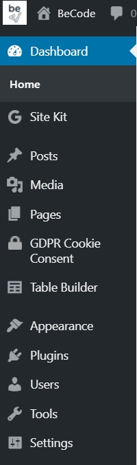

# The dashboard

Once you log in, you find the WordPress home interface called `Dashboard`. That’s the WordPress home page which will allow you to know all the recent activity of your website  at a glance. From that point, you can completely manage your website content.

 
## Sidebar

The WordPress Sidebar is the administrative navigation menu. It takes over the different functionalities which will allow you to perform actions. When you click on a menu, it will open to bring up other features that are dependent on it.

By default, the menu's features are presented like that :

- Dashboard
- Posts
- Medias
- Pages
- Commentaries
- Appearence
- Plugins
- Users
- Tools
- Settings

This menu can be different depending on the site, you can have more if you have plugins installed on your WordPress.

You can also rearrange this menu using [hooks](https://code.tutsplus.com/articles/customizing-your-wordpress-admin--wp-24941).

## Change Theme

Go to Appearance -> Themes 

To change themes, click Activate.

You can also click on `Add` to download a Theme.

If you remove from the menu the possibility to change the theme (to prevent a client from doing it for example), you can still access it via the theme.php template. Example : `http://localhost/firstWordPress/wp-admin/themes.php`

----

[04. Pages, Posts, Taxonomies: organise your site](04.Pages.md)
