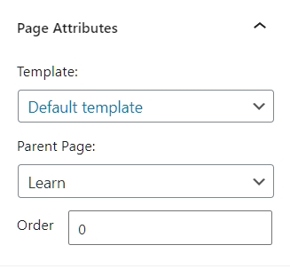

# Pages, Posts & Taxonomies

## Difference between post and page

WordPress allows you to create two main types of content, posts and pages.

- Posts are adapted to content posted regularly, it often corresponds to a news feed. There is a date, an author, we can make comments. 
To sort them, we often assign them a category.

- Pages are the fixed content of your site. For example, the home page, the contact page, the presentation page. Pages may also have a hierarchy, such as sub-pages. For example, a Our Specialties page may contain sub-pages for pizzas and pasta. 

[Learn more about that](https://www.shoutmeloud.com/wordpress-pages-vs-posts.html#:~:text=Here's%20the%20big%20difference%20between,you%20should%20use%20a%20post.&text=WordPress%20pages%20do%20not%20have,meant%20for%20static%2C%20timeless%20content.) 

## Organizing ones content : sub-pages and taxonomies

It’s important to define the tree structure of your site before starting. 

What are the pages? Can we group some of them together and decline sub-pages? Do we have different types of posts or do they all talk about the same subject?

The tree structure will also define the construction of your theme through PHP templates.

### Taxonomies

For posts, WordPress proposes **taxonomies**: *category* and *tag*.  

The categories are hierarchical (we can have categories, containing subcategories containing subcategories, etc.). In general, it is considered that articles should be classified in only one category.

Tags, on the other hand, are not hierarchical and we consider that it is better to associate to each article two or three tags (and not a single one). Tags allow more "cross-cutting" content navigation, while categories allow more structured navigation.

You can choose the categories of a post in a tab on the right when editing a post.

### The sub-pages

The pages are organized into *pages* and *sub-pages*. We talk about **hierarchical relationships** or *parent-child* relationships.

You can choose a parent page from the Attributes tab when editing a page.

NB: In the image below, you see the option `Template`. I will come back to this in the chapter on [Template Hierarchy](01.hierarchy.md)

----

[05. Menu](05.navigation.md)
