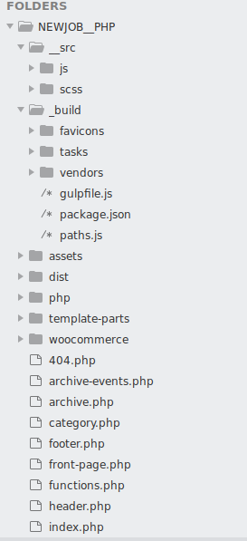

# Organise your Theme folder

I already talked about the tree structure of your site and not to repeat your templates.

Now, I’m giving you an organizational tip before I start a concrete project.
In the root of your theme, leave only the basic templates: `front-page.php`, `footer.php`, `page-contact.php`, `single.php` ect...

You can create as many folders as you want to set up your own structure.
For example, create a `template-parts` folder to put php code tips such as lightboxes, svg logos, a small menu...

Or create a folder to put all your customization hooks, because there can be many and you will soon be lost in simple `functions.php`.

Finally, there is all the JS or Sass infrastructure to put in place.

Here is an example of a structure:

----

I think that now you know a lot of things, it only remains to move on to practice!

[ACF](../ACF/)
